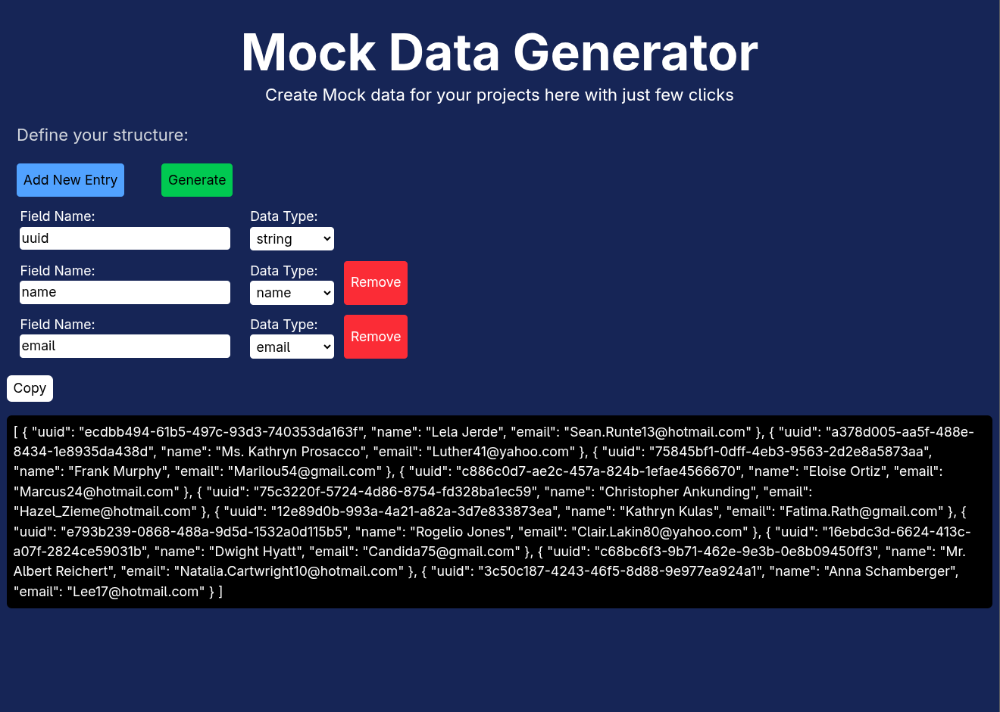

# Mock Data Generator 📝

A simple web application that dynamically generates random data based on user-defined fields and types using [Faker.js](https://fakerjs.dev/). Users can add multiple fields, specify their data types, generate sample data, and easily copy it to the clipboard.

## Features

- Dynamically add and remove fields with custom names and data types.  
- Supports multiple data types:  
  - `string`, `integer`, `float`, `boolean`  
  - `name`, `email`, `phone`, `date`  
  - `image_url`, `file_url`, `object`, `array`  
- Generates 10 random entries per request (can be modified in code).  
- Displays generated data in a formatted JSON block.  
- **Copy to clipboard** functionality with visual feedback.  
- Built with **Vanilla JS**, **Axios**, **Express**, and **Faker.js**.  
- Styled with **Tailwind CSS** for a clean UI.

## Screenshot


## Installation

1. Clone the repository:

```bash
git clone https://github.com/shalinv/Mock_Data_Generator.git
cd Mock_Data_Generator
```
2. Install dependecies
```bash
npm install
```
3. Run the server
```bash
node server.js
```

4. Open the browser and checkout
```
http://localhost:3000/
```


